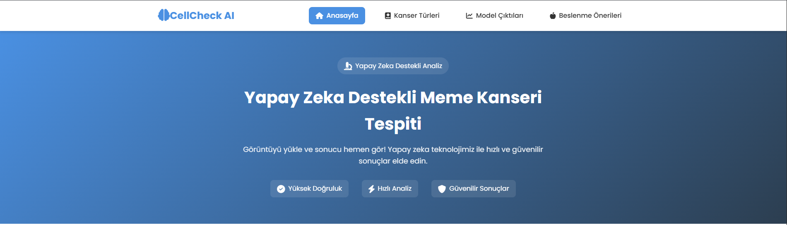
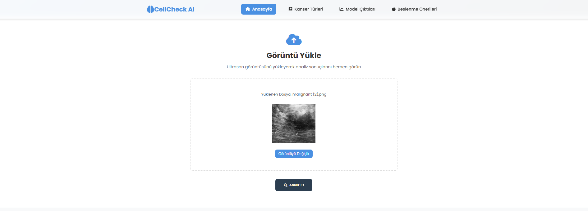
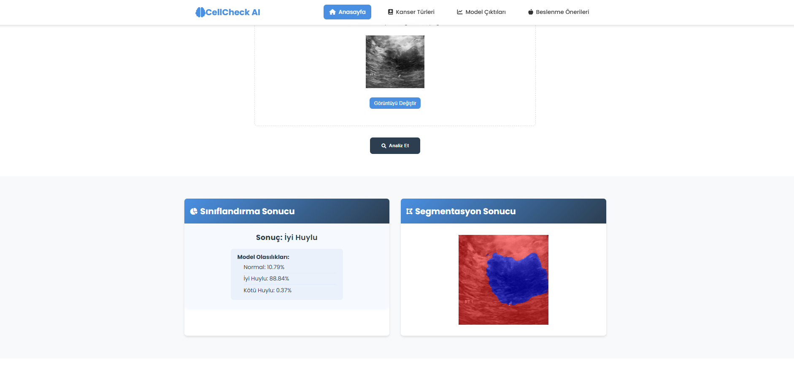

# 🎗️ CellCheck AI - Yapay Zeka Destekli Meme Kanseri Tespit Sistemi

<div align="center">
  
  <br><br>
  <a href="https://www.python.org/"></a>
  <a href="https://www.tensorflow.org/"></a>
  <a href="https://flask.palletsprojects.com/"></a>
</div>

<br>

---

## 🚀 Hızlı Bakış

**CellCheck AI**, meme kanseri teşhisinde yapay zeka destekli analiz ve segmentasyon sunan, modern ve kullanıcı dostu bir web uygulamasıdır. Ultrason görüntülerini yükleyerek, anında sınıflandırma ve segmentasyon sonuçlarını görebilirsiniz.

---

<br>

## 🎬 Canlı Demo

<div align="center">
  <a href="https://youtu.be/ORNEK-LINK" target="_blank">
    
    <br>
    <b>▶️ Uygulamanın Çalışmasını İzleyin</b>
  </a>
</div>

---

<br>

## 📋 İçindekiler

- [Proje Tanıtımı](#proje-tanıtımı)
- [Ekran Görüntüleri](#ekran-görüntüleri)
- [Özellikler](#özellikler)
- [Kullanım Senaryosu](#kullanım-senaryosu)
- [Kurulum ve Çalıştırma](#kurulum-ve-çalıştırma)
- [Model ve Veri Seti](#model-ve-veri-seti)
- [Teknik Detaylar](#teknik-detaylar)
- [Katkı ve Lisans](#katkı-ve-lisans)
- [Geliştirici](#geliştirici)

---

<br>

## 🩺 Proje Tanıtımı

CellCheck AI, meme kanseri teşhisinde doktorlara yardımcı olmak amacıyla geliştirilmiş, derin öğrenme tabanlı bir web uygulamasıdır. Kullanıcılar ultrason görüntülerini yükleyerek, **otomatik sınıflandırma** (Normal, İyi Huylu, Kötü Huylu) ve **segmentasyon** (kitlelerin sınırlarının belirlenmesi) sonuçlarını anında görebilirler.

---

<br>

## 🖼️ Ekran Görüntüleri

<div align="center">
  
  
  
</div>

> **Not:** Kendi ekran görüntülerinizi `images/screenshots/` klasörüne ekleyin ve burada kullanın.

---

<br>

## 🌟 Özellikler

- **Kullanıcı Dostu Arayüz:** Modern ve sezgisel tasarım.
- **Gerçek Zamanlı Analiz:** Ultrason görüntüsünü yükleyin, sonucu anında görün.
- **Sınıflandırma:** Görüntüyü Normal, İyi Huylu veya Kötü Huylu olarak sınıflandırır.
- **Segmentasyon:** Kitlelerin sınırlarını renkli olarak gösterir.
- **Model Olasılıkları:** Sınıflandırma için güven skorlarını gösterir.
- **Bilgilendirici Sayfalar:** Kanser türleri, risk faktörleri ve beslenme önerileri.
- **Mobil Uyumlu:** Tüm cihazlarda sorunsuz çalışır.

---

<br>

## 🧑‍💻 Kullanım Senaryosu

1. **Görüntü Yükle:** Ana sayfada ultrason görüntüsünü seçin veya sürükleyip bırakın.
2. **Analiz Et:** "Analiz Et" butonuna tıklayın.
3. **Sonuçları İncele:** Sınıflandırma ve segmentasyon sonuçlarını, model olasılıklarını ve bilgilendirici içerikleri görüntüleyin.

---

<br>

## ⚙️ Kurulum ve Çalıştırma

### 1. Depoyu Klonlayın

```bash
git clone https://github.com/memollizm/Breast-Cancer-Detection.git
cd Breast-Cancer-Detection
```

### 2. Gereksinimleri Yükleyin

```bash
pip install -r requirements.txt
```

### 3. Uygulamayı Başlatın

```bash
python app.py
```

> Uygulama varsayılan olarak `http://localhost:5000` adresinde çalışır.

---

<br>

## 🧠 Model ve Veri Seti

- **Veri Seti:** [BUSI with GT](https://www.kaggle.com/datasets/aryashah2k/breast-ultrasound-images-dataset) (Normal, İyi Huylu, Kötü Huylu)
- **Segmentasyon Modeli:** U-Net (ResNet50 backbone)
- **Sınıflandırma Modeli:** Basit CNN (2 Conv2D + Dense)
- **Eğitim:** 2,500+ ultrason görüntüsü, veri artırma ve ön işleme ile

---

<br>

## 🔬 Teknik Detaylar

### Backend

- **Flask** ile REST API
- `/classify` : Görüntü sınıflandırma (Normal, İyi Huylu, Kötü Huylu)
- `/segmentation` : Görüntü segmentasyonu (kitle sınırları)
- **TensorFlow** ile model yükleme ve tahmin
- **OpenCV** ile görüntü işleme

### Frontend

- **HTML5, CSS3, JavaScript**
- Modern, responsive ve etkileşimli arayüz
- Sonuçların görsel olarak sunulması

### Klasör Yapısı

```
├── app.py
├── models/
│   ├── resnet50_unet_breast_cancer.h5
│   ├── cnnBreastCancer.keras
│   └── segmentation_model.py
├── templates/
│   ├── index.html
│   ├── detay.html
│   ├── train.html
│   └── nutrition.html
├── script/
│   ├── index.js
│   ├── detay.js
│   ├── train.js
│   └── nutrition.js
├── style/
│   ├── main.css
│   ├── detay.css
│   ├── train.css
│   └── nutrition.css
├── Dataset_BUSI_with_GT/
│   ├── normal/
│   ├── benign/
│   └── malignant/
└── ...
```

---

<br>

## 🤝 Katkı ve Lisans

- Katkıda bulunmak için lütfen bir fork oluşturun ve PR gönderin.

---

<br>

## 👨‍⚕️ Geliştirici

**Mehmet Başgöze**  
[LinkedIn](https://www.linkedin.com/in/mehmetbasgoze/) | [GitHub](https://github.com/memollizm)

---

<div align="center">
  <sub>Bu proje, erken teşhisin hayat kurtarabileceğine inananlar için geliştirildi. <br> Sağlık profesyonellerine ve hastalara destek olmayı amaçlar.</sub>
</div>

---

> **Uyarı:** Bu uygulama tıbbi teşhis amacıyla doğrudan kullanılmamalıdır. Sonuçlar yalnızca bilgilendirme amaçlıdır ve mutlaka bir doktora danışılmalıdır.

---

